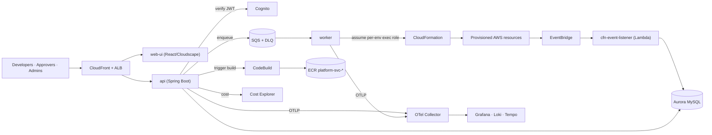

<div align="center">

# ☁️ AWS Self-Service Deployment Platform

**An internal developer platform (IDP) where a team provisions, deploys, promotes, and operates
its own AWS resources through a guided console — without writing CloudFormation, running Docker,
or holding AWS keys.**

Modelled on Sysco's *PaaStry*: a self-service catalog, source-to-image builds, GitOps templates,
approvals, cost visibility, and production-grade reliability — all behind one web UI.

`Java 21` · `Spring Boot 3.5` · `React 18 + Cloudscape` · `AWS Fargate` · `CloudFormation` · `OIDC CI/CD`

</div>

---

## Table of contents

- [What it does](#what-it-does)
- [Architecture](#architecture)
- [Repository layout](#repository-layout)
- [Getting started (local)](#getting-started-local)
- [Deploying to AWS](#deploying-to-aws)
- [Resource catalog](#resource-catalog)
- [Conventions](#conventions)
- [Status & roadmap](#status--roadmap)

---

## What it does

The platform is organised around seven capability areas. Everything a resource does is **tagged,
audited, and attributable** to a team and an environment.

### 🧩 Self-service provisioning
- A **catalog** of curated, versioned resource templates with category/text filtering.
- A **dynamic wizard** that renders any template's JSON Schema (client-side Ajv validation, draft
  persistence, idempotent submit).
- **Resource groups** — create a group, attach resources to it, filter by group, **cascade-delete**
  (including rolled-back/failed stacks) with a **restore** path.
- A **topology board** — a visual map of a group's resources and their relationships.
- **RDS** surfaces its connection outputs (host / port / managed-secret ARN) and can be placed in
  public subnets behind a **validated client-CIDR allowlist** for direct DBeaver access.

### ⬆️ Environment-as-attribute & promotion
- **One platform** serves `DEV → QA → STG → PROD`; the environment is a *property* of a resource,
  not a separate copy. Environments are loaded dynamically from SSM — no redeploy to add one.
- **Promote** the same resource up the chain (each tier assumes its own scoped execution role).
- Physical names are **environment-suffixed** so promotions never collide.

### 🚀 Source-to-image deployments
- The platform **builds container images itself via CodeBuild** (git clone → docker build → push
  ECR) — nobody runs Docker locally. Only repos in an **allowlisted GitHub org** may be built.
- Each service pushes to its **own ECR repository** (`platform-svc-<service>`, scan-on-push +
  keep-last-20 lifecycle), isolated from the platform's control-plane images.
- Builds return a **copy-paste-ready image URI** and a **"Deploy this image"** shortcut straight
  into the ECS wizard.
- Services run on a **per-group ECS cluster** (`platform-grp-<group>-<env>`), isolated from the
  platform control plane; optionally attach to the shared ALB on a path.

### 🛡️ Governance & approvals
- **PROD requests route to an approvals inbox** before anything is created, with **separation of
  duties** (a requester can't approve their own request).
- **Role-based access** via Cognito groups (User · Approver · Template Admin · Platform Admin).
- A **mandatory tag policy** on every resource (Owner, CostCenter, Environment, Application,
  ManagedBy, PlatformRequestId, SourceCommitSha) plus optional user tags via a **Tag Editor** —
  mandatory tags always win.
- An immutable **audit log** and an operator **runbook** library.

### 💰 Cost visibility
- **Cost Explorer-backed**, cached: month-to-date total, a 6-month trend, and a breakdown **by
  team (CostCenter) and environment**.
- **Per-resource cost** on each request, a **spend tile** on the dashboard, and a dedicated
  **Costs** page. Governance by *visibility*, not hard quotas.

### 🩹 Reliability & day-2 operations
- **Idempotency** (DynamoDB) and distributed **locks**.
- **Message-loss protection** — in-flight SQS work is released on shutdown, never stranded when a
  worker is replaced mid-deploy.
- A **reconciliation sweep** auto-heals requests stuck in-progress against real CloudFormation state.
- A **DLQ operator console** (depth, non-destructive peek, one-click redrive) + a **DLQ-not-empty
  alarm** and a central alerts topic.
- Database migrations run as a **halt-on-failure pre-deploy task**, never at app startup.

### 🔭 Observability & template lifecycle
- **OpenTelemetry → OTel Collector → Tempo** (traces), **Loki** (logs), **Grafana**, plus
  CloudWatch; every request deep-links to its own logs and traces.
- A **GitOps template pipeline** validates each version (schema · manifest · CloudFormation) and
  publishes **immutable versions** to S3; a Template Admin UI + full sync history round it out.

---

## Architecture

Hexagonal Spring Boot control plane + a Cloudscape console, deployed as **one platform** and driven
entirely by CloudFormation with SSM for wiring. A full editable diagram lives at
[`docs/architecture.drawio`](docs/architecture.drawio) (open in [diagrams.net](https://app.diagrams.net)).



| Layer | Technology |
| --- | --- |
| **Frontend** | React 18 · TypeScript · Vite · AWS Cloudscape Design System (served via CloudFront + ALB) |
| **Backend** | Spring Boot 3.5 / Java 21 / Gradle — hexagonal, 10 modules; `api` + `worker` on ECS Fargate |
| **Data** | Aurora / MySQL 8 via RDS Proxy · SQS + DLQ · DynamoDB (idempotency + locks) · S3 (template registry) |
| **Eventing** | EventBridge (CloudFormation stack events) → Lambda → Aurora |
| **Auth** | Cognito user pool + OIDC — JWT bearer on every API call |
| **Execution** | CloudFormation via per-template, per-environment STS execution roles |
| **Build/Deploy** | CodeBuild (source-to-image) → per-service ECR → ECS Fargate (EKS on the roadmap) |
| **Observability** | OpenTelemetry → OTel Collector → Tempo (traces) · Loki (logs) · Grafana · CloudWatch |
| **CI/CD** | GitHub Actions with **OIDC federation — no long-lived AWS keys** |

**Backend modules:** `domain` · `api` · `worker` · `persistence` · `messaging` · `aws-clients` ·
`security` · `observability` · `templatesync` · `app-common`.

**CloudFormation stacks:** `network` · `data` · `auth` · `compute` · `iam` · `events` · `cdn` ·
`observability` · `codebuild` · `eks-cluster` · `eks-deployer` (+ a one-time `bootstrap`).

**Sources of truth:** **CloudFormation** = what exists · **Aurora** = what was asked for ·
**Git** = template truth · **S3** = downstream cache.

---

## Repository layout

```
backend/          Spring Boot multi-module Gradle project (api, worker, domain, …)
frontend/         React + Cloudscape web UI
infrastructure/   CloudFormation stacks (bootstrap + platform)
templates/        Versioned resource templates (synced to S3 by the template pipeline)
lambdas/          cfn-event-listener (stack status → Aurora)
dev/              docker-compose local stack + Makefile
docs/             architecture diagram, ADRs, runbooks
.github/          CI/CD workflows, CODEOWNERS, PR template
```

---

## Getting started (local)

**Prereqs:** Docker, JDK 21, Node 20+.

```bash
# 1. Local dependencies: MySQL + LocalStack + observability
cd dev && make up

# 2. Backend (separate terminals)
cd backend && ./gradlew :api:bootRun    --args='--spring.profiles.active=local'
cd backend && ./gradlew :worker:bootRun --args='--spring.profiles.active=local'

# 3. Frontend — proxies /api → :8090
cd frontend && npm install && npm run dev        # http://localhost:5173
```

The `local` profile uses a dev-header auth bypass (compiled out of prod builds) and a **stubbed
CloudFormation driver** — LocalStack CFN isn't faithful enough for real lifecycles.

**UI-only / offline:** run the frontend with `VITE_USE_MOCKS=true` to exercise every page against a
built-in mock API (also how the Playwright golden-path E2E runs).

```bash
cd frontend
npm run build        # type-check + production build
npm test             # Vitest unit tests
npm run e2e          # Playwright golden path (mock mode)
cd ../backend && ./gradlew build   # backend build + tests (Testcontainers where Docker is available)
```

---

## Deploying to AWS

1. **Bootstrap once** (fresh account) — creates the S3 buckets, ECR, the GitHub OIDC provider, and
   CI roles. Everything downstream reads its wiring from SSM under `/platform/{env}/…`; nothing is
   hardcoded to an account.
2. **Merge to `develop`** → GitHub Actions (via **OIDC**, no stored keys):
   - runs DB migrations as a **dedicated pre-deploy ECS task** (halts the deploy on failure),
   - builds & ships the `api`/`worker`/`web-ui` images,
   - applies the CloudFormation stacks.
3. The **template pipeline** validates and publishes template versions from the branch to S3.

Resources are created **tagged with their environment** and promoted up the chain from each
request's page — the single platform serves all environments.

> **Cost note:** a production posture (Multi-AZ Aurora, multiple NAT gateways, VPC endpoints) is
> non-trivial. Stacks default to **dev-lite** switches (single NAT, small instances, min-1 tasks);
> flip the scale parameters for prod.

---

## Resource catalog

| Template | Category | Highlights |
| --- | --- | --- |
| **S3 Bucket** | Storage | Versioned, encrypted, Block Public Access enforced |
| **SQS Queue** | Integration | SSE, optional dead-letter queue |
| **DynamoDB Table** | Database | On-demand, PITR, optional TTL/sort key |
| **SNS Topic** | Integration | Encrypted, TLS-only, standard or FIFO |
| **Lambda Function** | Compute | Least-privilege role, log retention |
| **RDS MySQL** | Database | Managed master password, private or **public+CIDR** (DBeaver) |
| **ECS Service** | Compute | Fargate service on the **per-group cluster**, optional ALB path |
| **ECS Scheduled Task** | Compute | Cron/rate container job (the Kubernetes CronJob equivalent) |
| **EKS Service** | Compute | _On the roadmap_ |

Templates are **immutable once published** and versioned (`<template>/<major.minor.patch>/` with
`template.yaml`, `schema.json`, `manifest.json`).

---

## Conventions

- **Conventional Commits**, PRs only (branch protection).
- Every state-creating `POST` takes an **`Idempotency-Key`** (UUIDv7) header.
- Errors are RFC 9457 **`application/problem+json`**.
- The OpenAPI spec ([`backend/api/src/main/resources/openapi.yaml`](backend/api/src/main/resources/openapi.yaml))
  is the API contract; it's Spectral-linted in CI.
- Mandatory tags on every provisioned resource; user tags never override them.

---

## Status & roadmap

| Area | Status |
| --- | --- |
| Catalog, wizard, groups, topology, approvals, promotion | ✅ Live |
| Source-to-image builds · per-service ECR · per-group clusters | ✅ Live |
| Cost visibility · Tag Editor · DLQ console + alerts | ✅ Live |
| Reconciliation · message-loss protection · pre-deploy migrations | ✅ Live |
| Observability (Grafana · Loki · Tempo) | ✅ Live |
| Least-privilege execution roles (dev / qa / stg) | ✅ Live · prod gated |
| Alert routing (Slack / PagerDuty) · Managed Prometheus metrics | 🔜 Planned |
| GitHub App webhook · EKS backend · canary rollouts · SCIM · WAF/SAST | 🔜 Planned |

---

<div align="center">
<sub>Built as a PaaStry-style internal developer platform. Diagram: <code>docs/architecture.drawio</code>.</sub>
</div>
